## 19.1 Lesson Plan - React, Gently.

### Overview
In this class, we will be introducing students to the basic concepts of ReactJS, JSX, and building layouts through a component-based mindset.

##### Instructor Priorities:

* Students should be able to articulate a basic definition of components.
* Student understand the role Babel and Javascript Transpiling play in working with JSX.
* Students should be exposed to a variety of simple exercises on rendering JSX content to the DOM using React.JS

#### Instructor Notes:

* Let students know that today's class is a **gentle** introduction to React. Very few of your students will have even the faintest knowledge of react -- so this class is all about an initial exposure. 

* Let students know that we won't be able to teach them all of React in a week. In order to "get good" they are going to have to do their own work outside of class. Our role is essentially, to give them the high-points so they understand the terms and know how to proceed.  

* Have your TAs reference [19.1-TimeTracker](19.1-TimeTracker.xlsx) to help keep track of time during class.

--------

### Class Objectives

* To gain an initial exposure to JSX, Babel, and the concept of Javascript Transpiling
* To gain an initial understanding of the component-based paradigm in ReactJS
* To dissect and build a few simple examples using ReactJS. 

--------

### 1. Instructor Do: Go through Powerpoint (15 mins)
* Go through the ReactJS slides.

* The most important part to get across is the concept of components -- pre-bundled code that self-contains HTML and Javascript by functionality (i.e. all of the layout and functionality code for a "chat box" or "like button" would be in the same block). This is radically different from the concept of separating layer and logic. 

* Remember to emphasize that today's class is meant to be a primer. Not comprehensive coverage. Don't let them get intimidated.

### 2. Partners Do: Documentation Research (20 mins)
* Group your class into teams of 3 or 4. Then slack out the questions in the folder `ReactJS.txt`. 

* Have them work with one another on answering the questions (and tasks) listed using the ReactJS documentation. Let them know in advance that the documentation will feel challenging -- but being a professional developer requires a willingness to trudge through difficult material and learn on the fly. 

* Encourage them to take this task seriously as it will help them gain a basic sense of things.

### 3. Instructor Do: Review Questions (10 mins)
* Then call on various students to answer each of the questions. If you get stuck, refer back to `ReactJS_answers.txt`

--------

### 4. Break (15 min)

--------

### 5. Instructor Do: Babel-Sublime Setup (10 mins)

* Take a few moments to help students set up their Sublime editors to work with JSX files. 

* To do this, begin by opening the Sublime package installer (Type: `ctrl/cmd+shift+p` Enter: `Install Package`).

* From here, search for the package called `Babel` and hit enter to install. Once the installation is complete close and restart Sublime. 

* Create and save a generic Javascript file. 

* Then navigate through the top menu of Sublime -> `View` -> `Syntax` -> `Open All with Current Exentsion` -> `Babel` -> `Javascript (JSON)`. This will configure Sublime to always use the Babel compiler when working with any Javascript file (ES6, React JSX, etc.)

* 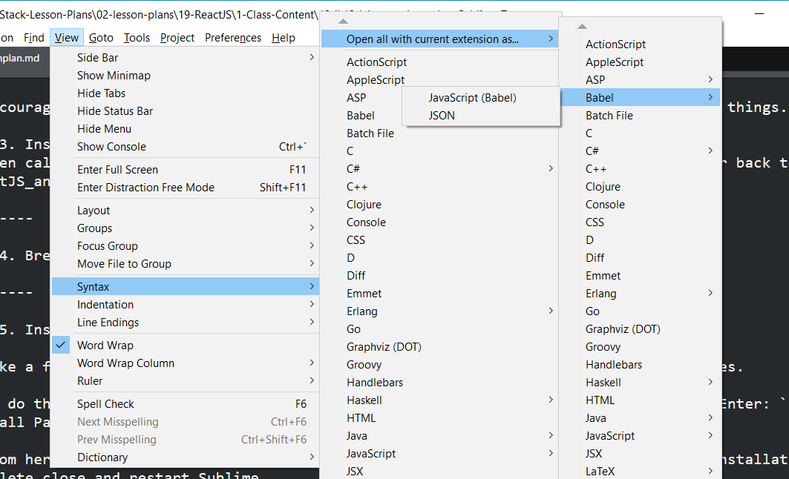

* Have TAs confirm that all students were able to complete this task.

### 6. Instructor Do: Webpack Setup (5 mins)

* Then open a Bash/Terminal instance and run the command `npm install webpack -g`. Have all students do the same.

* Immediately there after run the command `webpack` in Bash/Terminal. If it installed correctly it should ask for option information. (There are very rare instances in which some students may need to set their environment variables to allow webpack to be run from the command line. Have TAs work individually with these students if this is the case.)

### 7. Instructor Do: Hello React (10 mins)

* Open the folder `02-HelloReact` in Sublime. 

* Tell students to take notes as you explain to them the significance of each of the files.

* Go through the files in the following order using the comments to help guide the conversation. 

	* `webpack.config.js`: 

		* This file tells webpack (our packager) which files to compile and where to output the compiled code. Students may still be wary about what/why compiling is necessary. At this point, this is okay. You can come back to it after showing them the JSX. 

		* 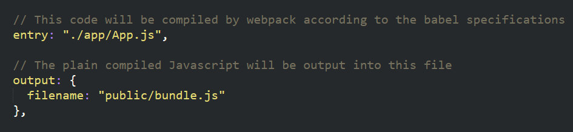

	* `package.json`: 

		* This includes all of the npm packages we'll be needing in the project. It will be semi-standard for all of our React projects with the addition of a few more. The key packages to mention are `React`, `React-Dom`, and the Babel transpilers.

	* `index.html`: 

		* This is the starting point of our application. This will also be the only file we "run" to see the effect of our React code. In essence, at the end of our project all of our React code will be compiled and put into `bundle.js` and all of our HTML will be rendered by React and put into the `app` div.

			* 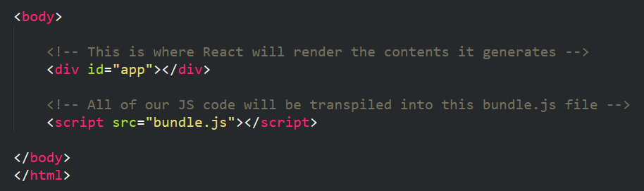

	* `bundle.js`: 

		* This is where al of our compiled Javascript will go. In essence, our compiler will take our JSX and turn it into plain javascript to be used in `index.html`. Initially it will always be empty. In our case, since we've already run the compiler we have code inside.`

	* `app.js`: 

		* This is the first "true" React file. Inside of this file, we pull in the React dependencies. Then utilize ReactDOM.render to take a simple paragraph element "Hello World" and output it to our `app` div in `index.html`. This step is very similar to our using jQuery to select an element and append HTML. With React we will be able to do far more complex tasks.  

		* 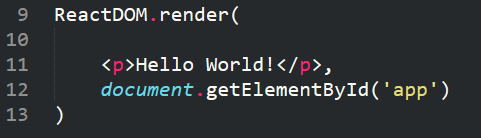

* Once you've discussed the code, navigate to the root directory of the `02-HelloReact` project. 

* Then run the command `npm install` to install the packages.

* Then run the command `webpack -w` via Bash or Terminal. This will compile the code and set a watcher to compile after any changes are detected.

* Now open the file `index.html` in the Browser. You should see a simple Hello World.

* Slack out the folder (zipped) for students to look at and discuss with their partners.

### 8. Partners Do: Discuss Hello React (10 mins)

* Slack out the following instructions for students.

* **Instructions:**

	* Take a few moments to discuss with your partner how each of the files work. 

	* Be sure to spend a good amount of time discussing how file relates to the to the others.
	
	* As an added suggestion, consider "drawing" it out in a diagram.

	* Be prepared to present to the class.

### 9. Instructor Do: Review Hello React (2 mins)

* Take a few moments to hear from students on how the files interact.

* Be prepared to answer questions and fill in gaps. 

### 10. Instructor Do: Hello Div (10 mins)

* Open the folder `03-HelloDiv` and walk students through the code.

* This example is very similar to the previous one. The only major change can be seen in the file `app.js`. Instead of simply displaying a simple Hello World paragraph, this one renders an entire block of HTML. 

* Here we are beginning to showcase the starting power of JSX. Through JSX we are embedding entire blocks of HTML inside of Javascript for rendering. The syntax is also very similar to native HTML.

* Be sure to point out that all of the contents needed to fit within the `
`. If you attempt to render a series of uncontained headers -- react will refuse to render.

* 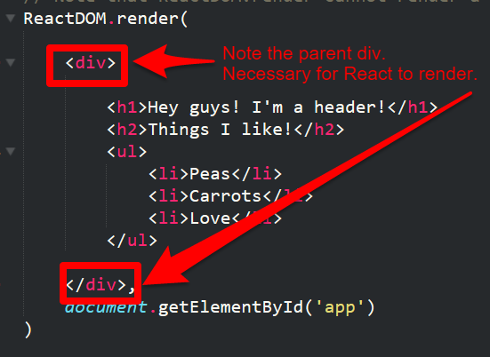

* Run the command `webpack -w` from the root of `03-HelloDiv` and then open the file `index.html`. Show students that the output is rendered HTML.

* Slack out the folder for students to utilize themselves.

### 10. Students Do: Discuss Hello Div (5 mins)

* Slack out the following instructions for students.

* **Instructions:**

	* Take a few moments to discuss the code with your partners.

	* Then try to change the code a bit so it renders differently.

	* Be sure each member of your group understands how to "test" that this code works.

### 11. Instructor Do: Review Hello Div (1 mins)

* Review with students and answer any pending questions.

### 12. Instructor Do: Hello Bootstrap (5 mins)

* Open the folder `04-HelloBootstrap`. 

* Again, this example is very similar to the last two except for two major differences. 
	
	* The first difference can be found in `index.html`. In order to utilize Bootstrap, we've included a reference to the Bootstrap CDN with the CSS.

	* The second diffence can be found in `app.js`. In this file you will see that instead of rendering generic HTML content, we are rendering an entire block of Bootstrap code. 

* There is one very **important** thing to mention about the Bootstrap code. Instead of using the word `class` to reference Bootstrap CSS classes. We instead change the term to `className`. This is a JSX gotcha because Javascript has `class` as a reserved keyword. 

* Point out how this is powerful. Because we effectively utilized our Bootstrap CSS inside of our JSX code without much of a fuss. It means that we can take existing layouts and quickly re-orient them into JSX.

* 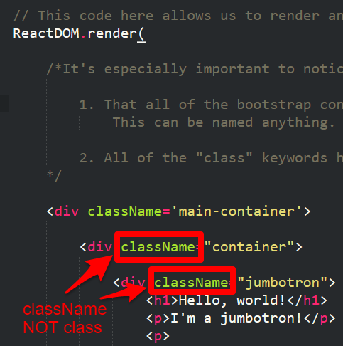

* At this point, do not slack out the code to students. 

### 13. Students Do: JSX Bootstrap (10 mins)

* Slack out the following instructions to students:

* **Instructions:**

	* Using the code from the previous example `03-HelloDiv` as a starting point, replace the contents of `app.js` such that it renders a simple Bootstrap layout.

	* Note: Be sure to remember the "Gotcha" about `class`.

	* Note: Be sure to remember to include Bootstrap CSS in `index.html`. 

### 14. Instructor Do: Review JSX Bootstrap (5 mins)

* Answer any pending questions. If there are none, ask a student a class any question about JSX so far. 

### 15. Instructor Do: Variables in JSX (7 mins)

* Now we get to the good parts! The true power of JSX lies in the fact that we can quickly incorporate Javascript variables and functions inside of our HTML. This will be demonstrated here. 

* Open the folder `05-JSXVariables` in Sublime. Then navigate to the file `app.js` (all other files are constant).

* Point out that in this file we've created a set of basic variables at the top.

* 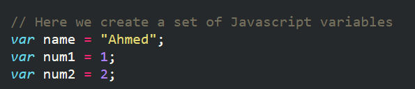

* 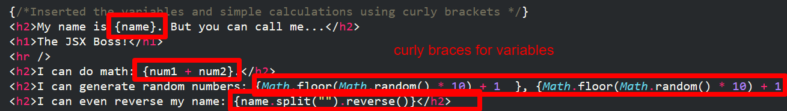

* We then included those variables inside our JSX using curly braces {}. 

* Not only did we directly insert basic variables, but we were also able to insert variables with methods running on them. 

* This means we can create more complex HTML that immediately responds to Javascript logic. (There are limits to what we can put inside the curly brackets. For instance, no for-loops... but this is powerful nonetheless).

* Run `webpack -w` on the root of the folder. Then open the file `index.html`. Refresh the page a few time to show that the page is constantly generating new random numbers. 

* Then slack out the folder to students.

### 16. Partners Do: My Age in JSX (15 mins)

* Open the file `index.html` in `06-JSXMomemntJS-StudentsDo`. Point out that this example has a hardcoded date of birth variable and then uses MomentJS to calculate the age from that. 

* Slack out the following instructions to students. 

	* Create a simple React application that takes in a hard-coded DOB and then uses MomentJS to render the age of that person.

	* Display that DOB and age in the browser using JSX.

	* Hint: You will need to `npm install` MomentJS and utilize it inside of your `app.js`.

	* Note: Yep. We know you are rusty on MomentJS. 

### 16. Instructor Do: Review My Age in JSX (5 mins)

* Open the folder `06-JSXMomentJS-StudentsDo`. 

	* Point out that for this application to work you needed to first install MomentJS (which can be seen in the `package.json`).

	* Then navigate to the `app.js` file. Point out that Moment.JS is being used as it would be in any other Node application and that we use methods in Moment to do our calculations.

	* One important gotcha: React and JSX will not allow you to render an object inside of the curly brackets. These need to be made into strings or arrays before they can be rendered to the browser. This is why `.format` is necessary in the first example.

* 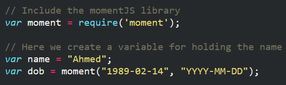

* 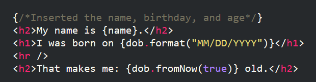

### 17. Instructor Do: My First Component (7 mins)

* Finally. The big kahuna of React. Components!

* Open the folder `07-MyFirstComponent`. Now open the drop-down to app and notice that a new folder called `Components` has been created. 

* Open the file `Header.js`

	* Explain to students that `Header.js` is a component. In essence, this means that it will be a "sub-piece" of our larger application. 

	* Point out that when creating components we need to include the react library and that we use the syntax of `React.createClass`. 

	* 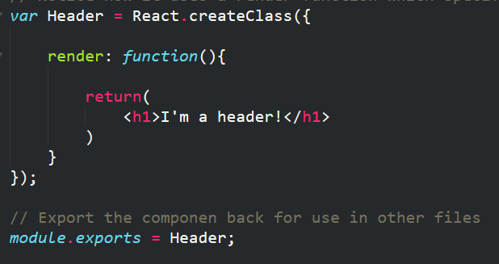

	* Inside of the the `createClass` function is `render` method. This is a required method for every class that describes what the component will "look like" in the HTML when rendered.

* Now open the file `app.js`. 

	* Point out that this file now includes a reference to the `Header.js`component.

	* Also point out that instead of rendering any pre-made HTML, in this case, we are simply putting in a reference to our `Header.js` component. We do this by typing out `<Header />`. In a way, we can come to think of `Header` as a new HTML type of element that React has created for us.
	
	* 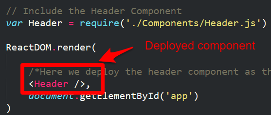

	* Let students know that this is a very powerful concept.

* Slack out the code from this example for students to look at.

### 18. Partners Do: Discuss My First Component (5 mins)

* Slack out the following instructions.

	* **Instructions:**

		* With your partners, discuss the code provided. 

		* Be sure to explain to one another how the component is created and rendered onto the page. 

### 19. Instructor Do: Review My First Component (5 mins)

* Take a moment to answer any questions that remain. If no questions are asked, call on a student to explain the method for creating a component. Call on another student to explain how it is rendered to the page.

### 20. Instructor Do: Multiple Components in JSX (5 mins)

* Then open the folder `08-MultipleComponents`.

* This is a similar example to the last, except this time, we have multiple pre-made components: `header`, `results`, `search`.

* Now if you open the file `app.js`, you will see that we were able to deploy each of these components into our `ReactDOM.render` function. We just needed to lump them all inside of a div. Again, this is because React will not let you render multiple "equal-level" components. There must always be a parent container.

* 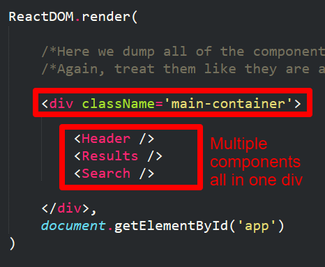

* Slack out the folder after discussing

### 21. Instructor Do: Showcase NYT React Homework (5 mins)

* Navigate to [http://react-nyt-app.herokuapp.com/](http://react-nyt-app.herokuapp.com/). Explain to students that this will be their homework this week (and perhaps next week).

### 22. BONUS: Partners Do: Build a Layout with Components (15 mins)

* With any remaining time in class have students work on the following activity.

* **Instructions:**

	* Create a layout using React made up of at least 3 components.

	* Each component should independently render a different set of content designed by Bootstrap (or Materialize).

-------

### Copyright 
Coding Boot Camp (C) 2016. All Rights Reserved.
