## 19.2 Lesson Plan - Rickety, Rackety, React

### Overview
In this class, we will be deepening students understanding of ReactJS. We will be particularly examining the concept of states and props, parent-child relationships, and lifecycle events. Towards the tail-end of the class, students will work heavily on an application that integrates Reat with an HTTP request. 

##### Instructor Priorities:

* Students should firmly understand how to pass data between parents and children components -- and vice versa.
* Students should understand the difference between states and props and the use cases for each.
* Students should have a cursory understanding of how HTTP requests can be integrated into a React application. 

#### Instructor Notes:

* Today's class will be more challenging than the last class for many students. Syntax errors will abound as students confusedly mix states and props, forget to pass attributes to their children components, and get lost by the concept of lifecycle events. Encourage students to be persistent and to constantly ask: "concrete questions". Let them know that there is no better way to learn, than by being self-critical and identifying one's own gaps in understanding. 

* Depending on whether or not your class falls on a weekday or Saturday, you may not have any time in class for the final activity `08-AddressFinder-Students`. If you do not have time for students to work on it in class, let them know that this activity is very similar to their homework assignment. They should refer back to if often when completing the NYT React assignment.

* Lastly, you may want to pre-zip each of the activity folders in advance. You will be slacking out entire application folders to students throughout class. (Heads-up: These are relatively large files.)

* Have your TAs reference [19.2-TimeTracker](19.2-TimeTracker.xlsx) to help keep track of time during class.

--------

### Class Objectives

* To gain an initial exposure to the React concept of states and props
* To gain a firm understanding of the concept of child-parent relationships in React
* To work on an extensive React application that utilizes an HTTP request to make API calls

--------

### 1. Instructor Do: Go through Powerpoint (15 mins)
* Go through the ReactJS slides.

* Note: That this poweropint is intended to set-up a high-level exposure to the concept of component architecting and React's unidirectional data flow. The majority of students in your class, will likely not follow the more abstract concepts -- so don't get bogged down here. Treat this powerpoint as a supplement for your more advanced students seeking a firmer grounding in the theoretical concepts that underpin ReactJS

### 2. Students Do: Warm-up Activity (12 mins)
* Open up the folder `01-WarmupActivity-Students`. Then run the commands `npm install` and `webpack -w` to render the program inside. 

* Next open the file `index.html` in your browser and show the page to students. Point out that there objective for the warm-up is to create a simple component-based application with three layers. Then slack out the instructions below.

* **Instructions:**

	* Create a simple application using ReactJS and Bootstrap, composed of four components (`app.js`, `child.js`, `parent.js`, and `grandchild.js`)

	* Have it so `parent.js` deploys `child.js`, and `child.js` deploys `grandchild.js`. 

	* Your application should ultimately display three panels, each inside of the other. 

### 3. Instructor Do: Review Warm-Up Activity (7 mins)
* Spend a few moments reviewing the code provided. 

* Begin by showing students the overall folder structure of `01-WarmupActivity-Students`. 

* Then proceed to examine the `webpack.config.js` and `package.json` files. 

* Then proceed to open `app.js` and point out the `ReactDOM.render()` function and the reference to the `<Parent />` component.

* Then proceed to open `Parent.js`, `Child.js`, and `Grandchild.js` each in turn. In each instance, point out that how the component is imported using the `require` function at the top, and how the component is deployed by each parent. 

* 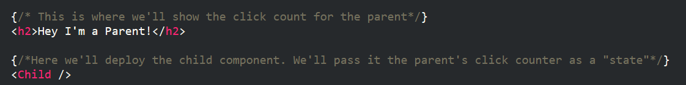

* 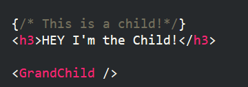

* 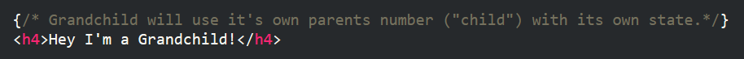

* Answer any questions, before slacking out the code. 

### 4. Instructor Do: Basic Props and States (7 mins)

* Preface the discussion of this next section by mentioning that in React the concept of handing information across components is an imoprtant one. Remind students that React's principal strategy is to go from Parent to Child and its the easiest form of data transfer.

* Then open the folder `02-BasicPropsState` and open the file `index.html` in the browser. Point out that this example is one in which two panels hold nearly similar profiles. The second is a child of the first and its attributes are based on the first. 

* Show students the folder directory and let them know that this application is nearly identical to the previous one. Instead, here we have just two key components: `child.js` and `main.js`. `Main.js` is the parent to the `child.js` component. 

* Then open the file `main.js` and point out each of the following:

	* `getInitialState()`: Mention that this function is found in most components. It essentially establishes the default variables associated with that component. In react these variables are called "states". They can be modified within the same component, and can be passed to children who inherit them as "props".

	* `{this.state.<BLAH>}`: Point out that we reference the state variables using the syntax of curly braces with a `this.state.` prefix. Let them know that `this` in this case refers to the component itself.

	* `<Child PROPERTYNAME={}>`: Point out that htis is the method for sending state information to children. Using this syntax, children inherit the parent's states in the syntax of `this.props.PROPERTYNAME`.

	* 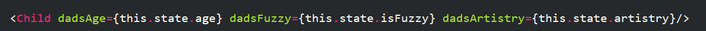

* Then open the file `child.js`.

	* Point out here how we reference the parent's properties using the `this.props.PROPERTYNAME` and then use them to determine what the child's properties will display.

	* 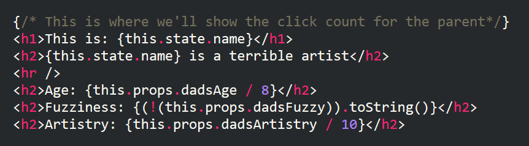

* See if there are any questions, then slack out the folder to students.

### 5. Partners Do: Discuss Props and States (5 mins)

* Task students with discussing the code provided, by slacking out the following instructions:

* **Instructions:**

	* Take a few moments to discuss the code provided to your partner. Make sure that each of you understand the syntax for:

		* Creating a state associated with a component.

		* Referencing the value of that state in the component itsef.

		* Passing that state value to a child.

		* Accessing that parent's state value in the child as a prop. 

	* Be prepared to share with the class.

### 6. Instructor Do: Introduce React Chrome Extension (7 mins)

* Take a few moments to download the React Chrome Extension.

* Then go into the options for the extension and enable the setting that allows its access to local file.

* Then re-open the `index.html` from the previous example and open Chrome Developer Tools.

* You should see a React Tab. Open that tab and begin typing the names of your components from this example (e.g. `Child` and `Main`). Point out that this tab keeps a live view of the states and props associated with each component. 

### 7. Partners Do: Parent to Child (20 mins)

* Now, open the file `index.html` inside of `03-Parent-to-Child-Students` slack out the following instructions:

* **Instructions:**

	* With partners, create a simple React application composed of a parent and three child components.

	* Inside of the parent event you will create code that handles a button click. Whenever the button click is clicked, a counter will increase by one. This counter will constantly communicate the new count to the children components.

	* The children components will then utilize the click counter and each perform a different mathematical operation with the counter.

	* Note: You will need to do some research to solve this. Look into answering the following questions:

		* How can I handle a button click event in React? (Hint: `onClick`)

		* How can I change the state of a component in React? (Hint: `setState`)

	* Note: This may be challenging! We haven't covered everything just yet. Push yourself to consult Stack Overflow and React Documentation. 

### 8. Instructor Do: Review Parent to Child (7 mins)

* Walk students through the solution. 

* Pay particular attention to each of the following:

* `parent.js`:

	* Has an `onClick` event associated with each of the buttons . These button clicks are associated with functions specific to the parent called `handleClick` and `resetClick`. These functions serve to change the state of the parent component using `setState`. Important Note: You should ALWAYS use `setState` when setting the state of variables associated with components. Do not use `state = "XXX"` as this will break the "live" connection that React maintains. 

	* 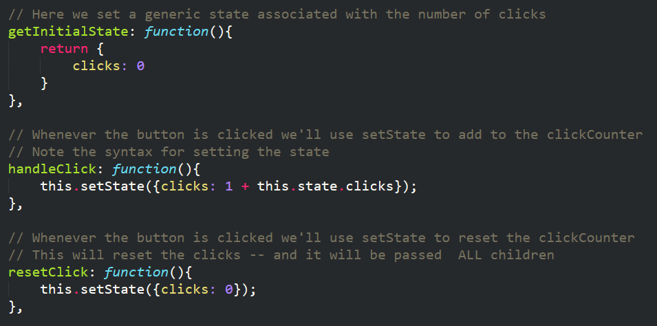

	* The parent passes its state counter to its children in the form of `<Child clicks={this.state.clicks}` and `<Grandchild clicks={this.state.clicks}`. This allows the children to inheri the click counter as a prop.

	* 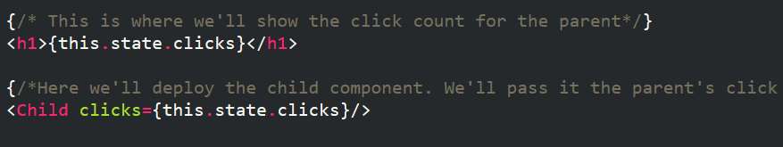

* `Child.js` and `GrandChild.js`: 

	* Both utilize the parent's click counter to calculate the value they should use. Both are using `this.props.number` in curly braces to access the property given to them by the parent.

	* 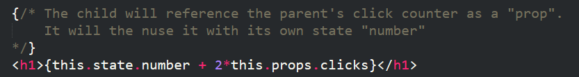

	* 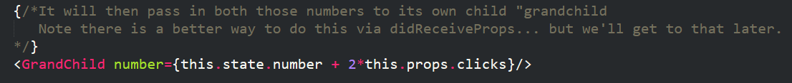

* Then slack out the solution to students in a zipped folder.

--------

### 9. Break (15 mins)

--------

### 10. Partners Do: Crazy Click Counter (30 mins)

* Next open the `index.html` file inside of `04-CrazyClickCounters-Students`. Show students that in this example 4 components exist which each respond differently to the click counts.

* Then slack out the following instructions:

* **Instructions:**

	* Create a React application composed of 5 components (`main`, `adder`, `imgr`, `multiplier`, `randomizer`). 

	* Each of the components should respond differently in response to the button clicks taking place from the `main` parent. 

	* One of the components adds the click counts, another multiplies, another provides a random number, and a final one chooses a random image from an array of images. 

	* Hint: You may want to look into the React function: `componentWillReceiveProps`

### 11. Instructor Do: Review Crazy Click Counter (10 mins)

* Open up the `main.js` and each of the components in the `Panels` folder in turn. For the most part, `Adder`, `Multiplier`, and `Randomizer` are similar to the previous example.

* However, the `Imgr.js` file is worth examining in more depth. As you discuss this file, be sure to point out the following:

	* The `imgr` component includes a pre-filled array of images (`src`) and a selection number (`selection`) as part of its state.

	* 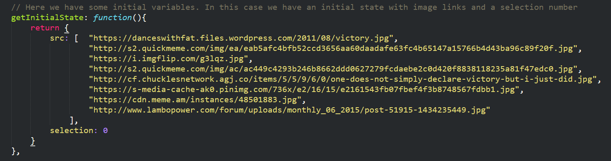

	* Whenever a prop is received, React triggers the `componentWillReceiveProps` lifecycle event. This is a known function in React that is triggered whenever a component receives any props from a parent. In this case, our parent `Main` is sending the `Imgr` component the click count as a prop. This in turn triggers this function to set the `selection` state as a random number.

	* 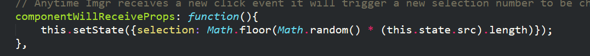

	* We then use this `selection` number as an array index to choose a random image to display each time the button is clicked.

	* 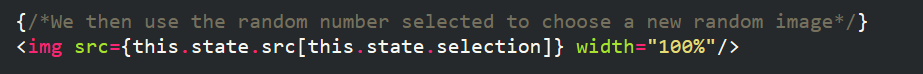

### 12. Instructor Do: Child to Parent (10 mins)

* Preface the next activity by reminding students that up until now, we've been exclusively sending data from Parents to Children in the form of sending states and receiving props. 

* Then let students know that this next activity shows how we can communicate data from children to parents, while still maintaining the locus of control in the hands of the parent.

* Run the file `index.html` in the browser. Show students that in this example, clicking the button in the child component updates the click count in the parent component. 

* Then open the component file `Parent.js`. Walk students through the following:

	* As always we set an initial state variable using `getInitialState`. In this case our state is `clicks`.

	* Then point out the function `setParent`. This is a function we created ourselves (it could be named anything). Let students know that its sole role as a function is to take in a number and to then use that number to change the state of the `clicks` counter.

	* 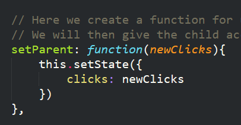

	* Then navigate to the part of the file where the `Child` component is deployed. Point out that in this example, we "pass" in the `setParent` method to the chid. This will allow the child to change the parent using the parent's permission.

	* 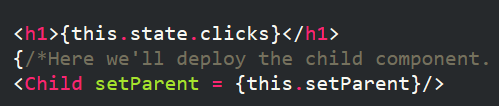

* Now open the component file `Child.js`. Point out the following:

	* We have an `onClick` event tied to a function called `handleClick`.

	* The `handleClick` function increases the click count of the child and then passes this value to the parent using the `this.props.setParent()` function. Emphasize this point. We passed in a function to the child. The child received the function as a prop -- enabling it to change the parent.

	* 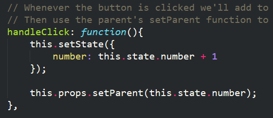

### 13. Students Do: Feed Me Seymour Activity (20 mins)

* Now open the file `index.html` inside of `06-FeedMeSeymour-Students`

* In this example, our friend Seymour sits in the parent component. Three snack options each reside in independent child components. Clicking each of the buttons updates Seymour's consumed amount by a different amount. (Obviously organic tofu isn't as satisfying as human flesh...)

* Then slack out the following instructions:

	* Create a similar "Feed Me Seymour" game to the one shown just now.

	* Your game should be composed of one parent component (Seymour) and three child components (Tasty Treats). 
 
	* Clicking buttons inside of the child components should increase the total "consumed" shown in Seymour's component by different amounts.

	* Once Seymour has consumed more than 500 an alert should be triggered saying something like: "Seymour is full!"

### 14. Instructor Do: Review Feed Me Seymour Activity (5 mins)

* Spend a few moments reviewing this example. 

	* The example follows the logic of the last one in that we create a generic function for updating the parent (`feedSeymour` in this case) and then pass that function to each child to update the parent. 

	* 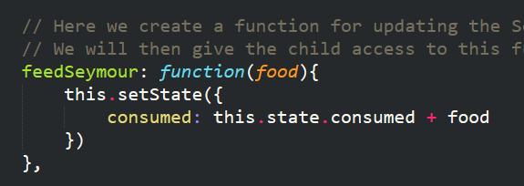

	* 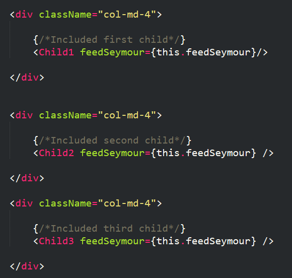

	* One notable distinction in this example is the use of `componentDidUpdate`. This function is a known React lifecycle event which is triggered anytime the component's state is updated (i.e. when a child updates the parent). This allows us to create the alert when Seymour has consumed more than 500.

### 15. Instructor Do: Form Handling (10 mins)

* Open the file `index.html` inside of `07-FormHandling`. Point out that in this example we have three simple text boxes. As you type into any of the textboxes it live-updates the results panel with the sum of the two numbers and the reverse text of the string. 

* Open the React Developer Tools and search for the `Form` component. Select this component, then begin typing into the textboxes. Point out that the state's associated with the textbox values are changing in real-time. 

* Now open the file `Form.js`, navigate to the render function, specifically where the `input` boxes can be found. Point out the presence of the `value`, `id`, and `onChange` attribute. Spend a few moment explaining the signifance of each:

	* `value` is a placeholder that we'll use to track the value of what's been typed.

	* `id` is our way of determining which textbox is which.

	* `onChange` is a specific React Form method that triggers a "check" each and every time React detects a change to the textbox. In our case, we have it set to trigger the execution of a component specific function called `handleChange`.

* Now scroll up to the `handleChange` function. 

	* Point out that the function works by capturing the `event` that triggered it (in this case the event is associated with the textbox).

	* Then explain that this function works by creating a new temporary object called `newState`. 

	* It then grabs the value of the textbox that changed (i.e. the one that triggered the `handleChange` event) using the `id` to identify it.

	* It then uses the `id` and `value` to change the state of the component.

	* 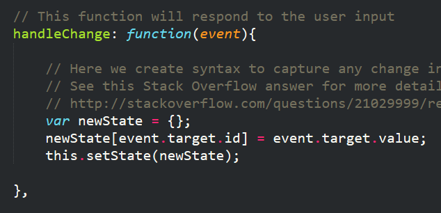

	* Its important to note that this example worked because we chose to specifically set the ids of each textbox to directly match the state of the component. There are other solutions out there, but this is one highly rated on Stack Overflow. Feel free to slack out the link to the [SO question](http://stackoverflow.com/questions/21029999/react-js-identifying-different-inputs-with-one-onchange-handler) to students.

* Slack out the code for this activity when done explaining.

### 16. BONUS Students Do: Address Finder (1.5 hours - Rest of class)  

* At this point, you may be out of time. But even so, take a quick moment to open the `index.html` file inside of the folder `08-AddressFinder-Students`. Explain to students that the code found inside of this activity is very similar to the one needed in the homework assignment. 

* There may be a few unfamiliar concepts like the use of the `axios` library to perform HTTP requests. However, encourage them to dig in and try to dissect the code themselves. 

* If you do have time remaining in class, encourage students to begin working on it until the end of class. 

-------

### Copyright 
Coding Boot Camp (C) 2016. All Rights Reserved.
