## 19.3 Lesson Plan - #LearnToMERN

#### Instructor Notes:

In this class, we'll be showing students how to integrate their React applications with a Node, Express, and MongoDB back-end. Towards the end of the course, we will further introduce students to the new concepts of ES6. 

#### Instructor Priorities:

* Students should firmly understand how to build a complete MERN (Mongo, Express, React, and Node) application.
* Students should understand both the concept and utility of React Router
* Students should gain a cursory knowledge of ES6.

#### Instructor Notes:

* Be expecting today's class to be a fairly challenging one. The transition from React to MERN involves significantly more complex applications as students' simple React applications will now need to make use of an Node Server, Express API, and MongoDB database. For many students, "getting started" and "getting organized" will present a huge opportunity for confusion.

* Despite, the challenge these concepts ARE important. Students will need to understand both routing and MERN integration to complete the recommended homework assignment. 

* Instructors/TAs: Spend the appropriate amount of time outside of class familiarizing yourself with the code -- particularly the `AddressMERN` example. Students will work on this activity for close to an hour of class, it's important that they feel supported throughout that time.

* Towards the latter-end of class, students will also be exposed to ES6 concepts. This exposure serves a dual-purpose: 1) Many job openings make mention of ES6 as being a desired trait and 2) Many of the tutorials for React Native utilize ES6 syntax. 

* Have your TAs reference [19.3-TimeTracker](19.3-TimeTracker.xlsx) to help keep track of time during class.

--------

### Class Objectives

* To obtain a firm grasp of the MERN stack (MongoDB, Express, React, and Node).
* To understand the concept of front-end routing with React Router
* To gain an initial exposure to ES6 Javascript.

--------

### 1.	Instructor Do: Intro to MERN (0:15)
* Welcome students back to class and proceed to explain to students that today they will be learning about the MERN stack. Explain to them what each letter of the acronym means (MongoDB, Express, React, Node) and what a "stack" means in the first place (a stack is a set of complimentary technologies that can be used to build full stack applications). 

* Describe how we'll be using ReactJS to handle the front-end of our application and Mongo, Express, and Node will handle the backend. If necessary create a diagram here to help make this clear.

* Then proceed to open the folder `01-IntroMERN > Unsolved`. Open the file `index.html` inside of the `public` folder. You should see the Click Counter application from before. Now, click the button a few times for students to see. Then close the browser. Ask students what the count will be when you re-open the file. (They should answer: 0). Re-open the browser, and show them that the value is in fact 0.

* Next, ask them what we could do to "save" the click count perpetually. (Possible Answers: LocalStorage or Database).

* Once you've heard the correct answers, open the folder `01-IntroMERN > Solved`. Then run `npm install` and finally run `node server.js`. Now open up a webrowser and visit `localhost:3000`. You should see our Click counter from before. Click the button a few times. Then close the browser and re-open it. This time you should see the click count preserved.

* Now, visit the page `localhost:3000/api` (while also on the main screen). Click the Click button a few times, then refresh the api page. Point out to students that as expected our application is updating the database and our api reflects that. Close the browser and re-open the page. Show that it preserves the number.

* 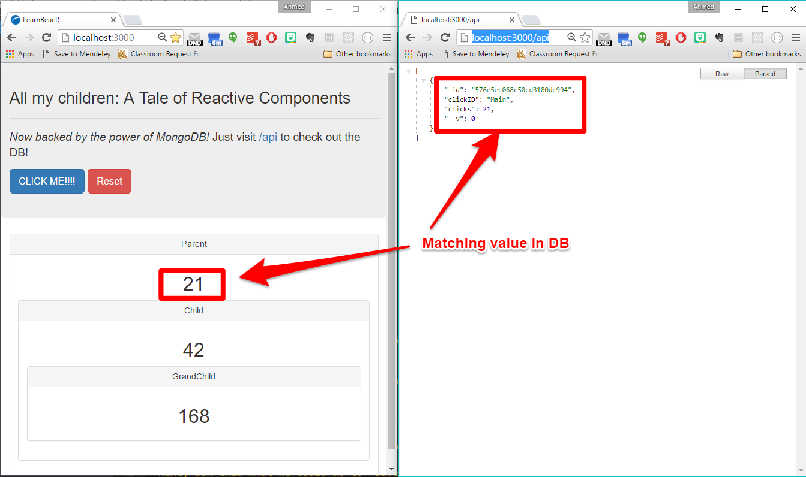

* Answer any questions before proceeding to the code. 

* **TAs:** Sack out the `SOLVED` and `UNSOLVED` code at this point, so students can follow-along with the differences.

* Open the `SOLVED` folder in Sublime. Then walk students through the key points of the MERN application:

	* Begin by pointing out the folder structure, specifically the addition of the `server.js` file and the `click.js` model. Let students that these two files were the ONLY new files in the application.
	
	* 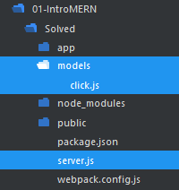

	* Point out the new npm packages added. These are the same ones we'd expect in working with MongoDB and Express -- packages like: `Express`, `Mongoose`, `Morgan`, and `body-parser`. We've also added in this package called `Axios` which we'll use to run HTTP requests.

	* 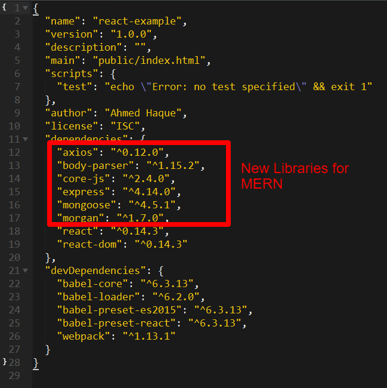

	* Next, open the `click.js` model. Ask students to walk you through the code or explain it for them. The code is nothing more than a simple Mongoose schema and model. The one key point is that we've created a `clickID` property which we'll be using to update the same click counter every time.

	* 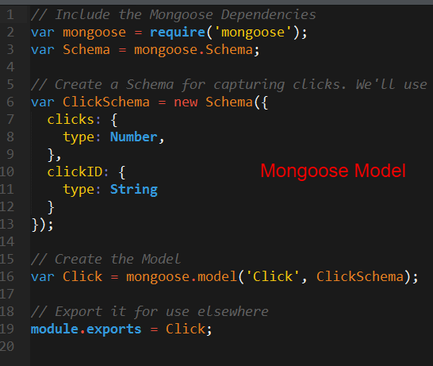

	* Next, open the `server.js` file. Point out how it's setup like most of our other servers. Remind students that this means: 

		* We've included our server dependencies at the top. We've included 
		
		* Included the configurations for packages like `body-parser` and set up our `static` folder.

		* Included a link to our MongoDB database. (In this case, we pre-created this database using Heroku's mLab).

		* 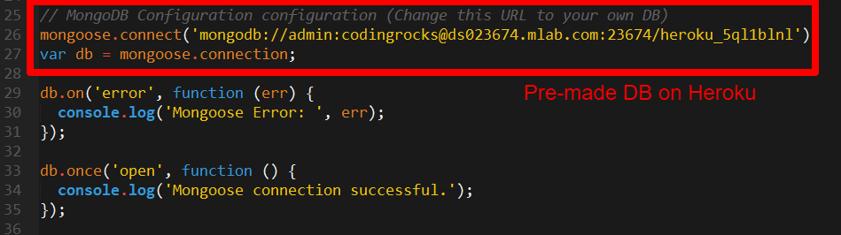

		* Then spend a significant amount of time walking students through the routing. Point out that we have three routes.

			1. A central GET '/' route. This is to point our server immediately to the React.js generated `index.html` file.

			2. An api based GET `/api` route. This route will be used to retrieve the click count. Here we use a simple mongoose `Click.find({})` to achieve this.

			* 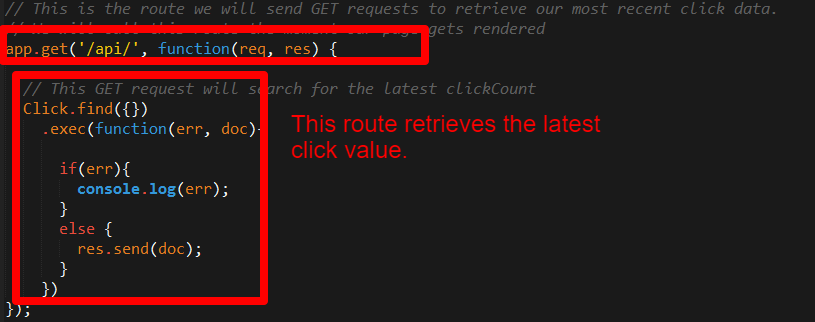

			3. An api based POST `/api` route. This route will be used to UPDATE the click count each time. Here we use a `findOneAndUpdate` function to find the click counter by its clickID and then change the click count. 

			* 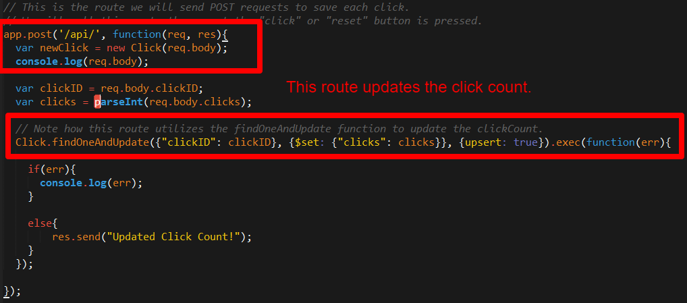

	* Now open the file `Parent.js` inside of the `Components` folder. Point out how we added in a `ComponentDidUpdate` and `ComponentDidMount` lifecycle events. Effectively these are functions that will get run whenever the page loads or whenever a state updates. In discussing these functions, point out the use of the `axios` functions. These are for performing the HTTP requests to the Express API.  

	* 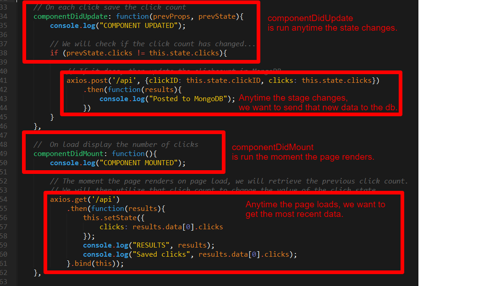

* Finally, re-run the application again for students so they can see how it works. As you navigate between the routes, point out to students how the results correlate with the code. 

### 2.	Partners Do: Discuss Intro to MERN		(0:10)

* Have students form up into groups of four. Task them with listing out every one of the code changes required to enable Mongo, Express, and React integration. 

* Encourage them to look at the code while completing this activity.

* When time is up have them share with the class.

### 3.	Partners Do: Address MERN (1:15)

* Now, take a moment to warn them that this next activity will be challenging -- but is very similar to the recommended homework assignment.

* Open the file `index.html` inside of `02-AddressMERN-Students` (`UNSOLVED`) in your browser. Show students that this application takes any city, location, zip code, or landmark and retrieves an understandable address. 

* Now navigate to the folder `02-AddressMERN-Students` (`SOLVED`) and run `npm install` and `node server.js`. Open your browser and visit `localhost:3000`. Run the same search, but this time, point out how the application not only shows the search result -- but also adds the search to the list of historic searches. 

* 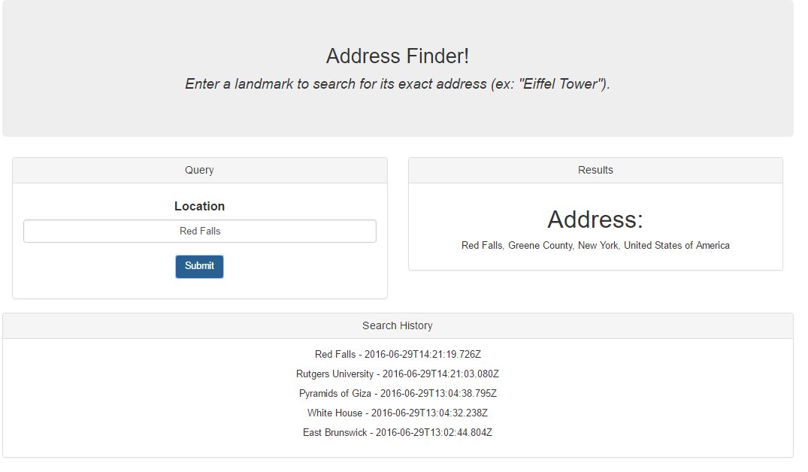

* Let them know that they will be taking the first app and incorporating the History component into their application. 

* Have groups form into 4 members then slack out the following files and instructions.

* **File:**
	
	* `UNSOLVED.zip` (`02-AddressMERN-Students`)

	* Screenshot of working app.

* **Instructions:**

	* Over the course of the next 1 hour and 15 minutes, you and your group will be "upgrading" the React application provided to incorporate MongoDB and Server integration. Your final application, should include a new React component for listing out the last five search terms and the datetime in which they were searched. 

	* The activity is challenging, but it is very much a REAL-WORLD problem similar to ones you will have to solve in your career, so take your best shot!

	* As you proceed, consider the following as advice:

		*  Divide your team into pairs. One pair will work on creating the front-end of the React application with the ability to capture data input. The second will create an initial server and API. Once you have both these pieces, work together to create the helper functions necessary to make HTTP requests to your API. 

		* Remember the general steps involved with incorporating a database into a React application:

			* Add a server.js file. 

			* Update your package list. 

			* Add a database. 

			* Add a model. 

			* Add a set of API routes. 

			* Create lifecycle events. 

			* Use Axios to perform HTTP requests onto API.
	
			* Test, debug, test, debug, test, debug...

	* Reach out to the Instructors / TAs as you have questions. 

	* Push yourselves! This will be a hard hour!

### 4.	Instructor Do: Review Address MERN		(0:15)

* Have TAs slack out the solution, prior to the discussion. 

* Then spend the appropriate time necessary to discuss the following: 
	
	* The general file structure of the final application -- noting the inclusion of a `helper.js` file to more neatly organize all of the HTTP calls.

	* The routes found in the `server.js` file -- specifically mentioning that three routes were necessary: One to send the HTML file, one to load the history data, and one to post the history data. If you'd like you can also walk them through the Mongoose query for limiting the response to only the most recent five search terms.   

	* 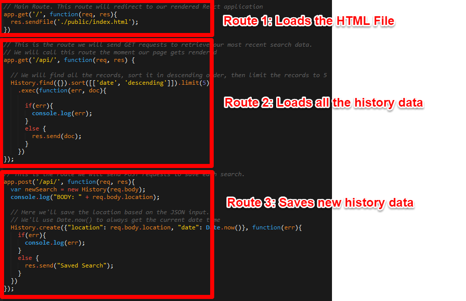

	* Point out the basic Mongoose model.

	* 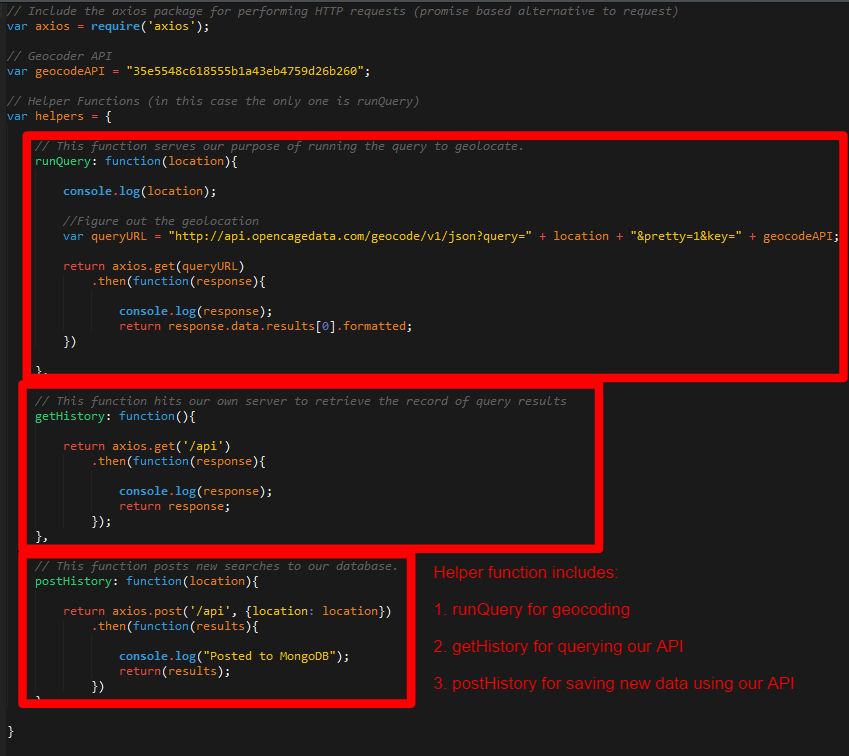

	* Open the `helper.js` file and walk students through the three functions we use to interact with the API shown previously. This code will require them to look at more closely, but the basic gist is that we use the axios library to perform API calls and return the data back to the React component.

	* 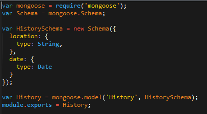

	* Open the `Main.js` file and point out how the helper functions are used anytime there is a component change (i.e. anytime a search is performed). 

	* 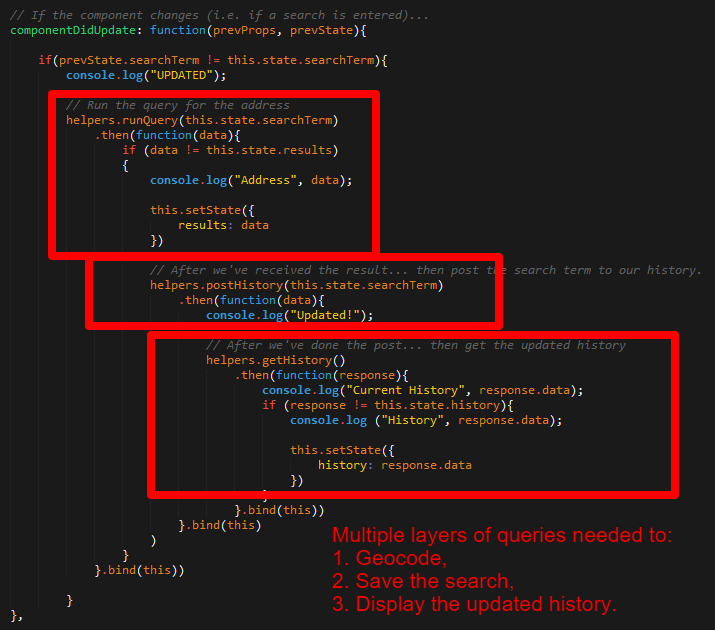

	* Point out that we also run the api call to get search results on the initial page load using `componentDidMount`
	
	* 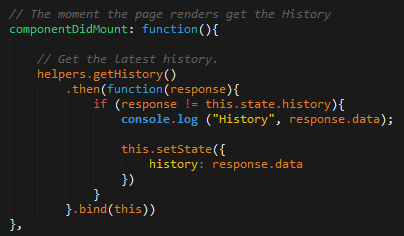

### 5.	Partners Do: Review MERN Solution		(0:10)

* Give students a few moments to review the solution before proceeding to break. Answer any questions that arise. 

* Let them know it was a hard activity and that they should invest time outside to better understand this example.

-------

### 6.	BREAK		(0:40)

-------

### 7.	Instructor Do: Intro Routing and Single Page Applications (0:10)

* Begin the next example in class, by visiting YouTube and searching for a random video. Play the video, and as it's playing click on various buttons on the Share, Embed, and Email buttons. Point out that the video isn't stopped while we flip between sub-pages.

* Now open the file `info.html` inside of `03-IntroRouting` in your browser. Start the video, then click on the "Comments" button. Point out to students that the page refreshed -- totally destroying the MJ Experience. Point out that this is the problem of using "hard links" to move between sub-pages in web development.

* Use this visual to introduce the concept of Single-Page Applications. Define an SPA as a web application that loads a single HTML page and dynamically updates the page with user interactivity. 

* 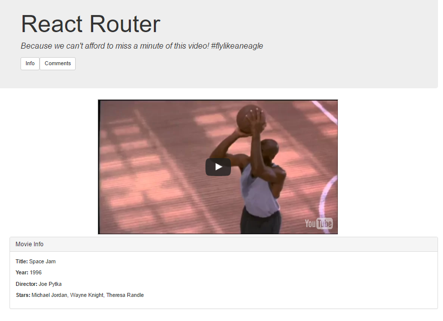

* Then open the file `index.html` inside of `2-SPA-React`. Play the video again and repeat the click experiment. Point out to students that in this example, the top part of the page is left unaffected by the user clicking on other parts. Let them know that this is a powerful concept that let's us build rich web applications. Also let them know that in order to achieve this we'll be using React-Router, a library which tracks the URL in React -- and then uses React to interpret what displays (as opposed to the server sending a new HTML file). 

* Open the folder `2-SPA-React` in Sublime. Then walk students through the code. Focus on the following as you do so:

	* The inclusion of the `Router`, `Route`, and `IndexRoute` dependencies inside of the `Route.js` file. (Note: React router is also inside of the `package.json` file).
	* 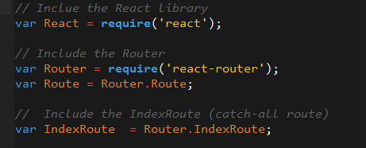

	* Open the file `app.js` and point to students that instead of rendering the usual `Main` or `Parent` components, here we are rendering `routes`. 

	* Then focus your attention on the `routes.js` file. Show students that this file exports a set of routes with paths and components. Essentially these routes specify which component is rendered when. By nesting routes inside of others, we can further specify which children are rendered when. 
	* 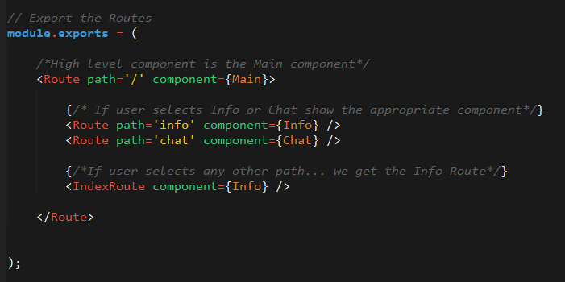

	* Now open the file `Main.js`. Point out to students the line `this.props.children`. This line of code effectively serves as a placeholder, for which the "children" of this component are dumped. How do we know who the children of `Main.js` are? It's what we specified in `routes.js` via nesting. 
	* 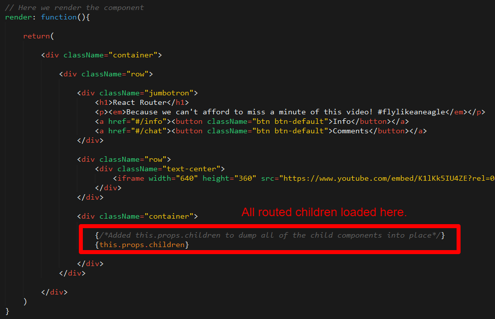

* Now if you re-run the code and flip between the links, you can show how the child rendered matches the one clicked on as specified by the routes. 

### 8.	Students Do: MyFirstRoute (0:35)

* Prepare students for a second challenge. Open the file  `index.html` in `04-MyFirstRoute-Students` in your browser. Click on the buttons at the top and show how it changes the panel on the bottom. Also show that Child #1 has its own set of buttons that can cause a flip between two of its own children. Let students know that they will be building this for the next 35 minutes.

* Slack out the following file and instructions:

* **File:** 

	* `index_design.html` (`04-MyFirstRoute-Students`)

	* Screenshot of working app

* **Instructions:**	
	
	* Spend the next 35 minutes taking the design provided to you and breaking it into routed child and grandchild components. 

	* As a starting point, create a basic route that flips between two panels on button click.

	* As a bonus, nest buttons and panels inside one of these child panels. The buttons should flip between these "grandchild" panels.

	* This may be tricky! Fight through it!

### 9.	Instructor Do: Review MyFirstRoute		(0:10)

* Once time is up, begin your discussion.

	* Start by pointing out the overall file structure. Pointing out all the files you needed.
	* 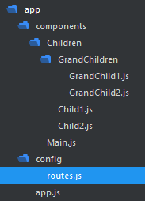

	* Then point out the code inside of `routes.js`. Point out how it has routes nested inside of routes.
	* 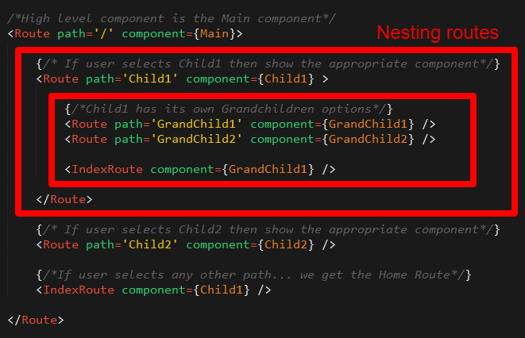

	* Then open the file `Main.js`. Point out how `this.props.children` is used. Also point out the `href` and how it points to `#/Child1/GrandChild1` or `#/Child1/GrandChild2/`
	* 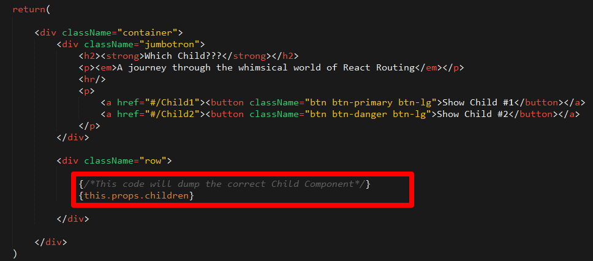

	* Then open the file `Child1.js`. Point out how `this.props.children` is used. Also point out the `href` and how it points to `#/Child1` or `#/Child2/`
	* 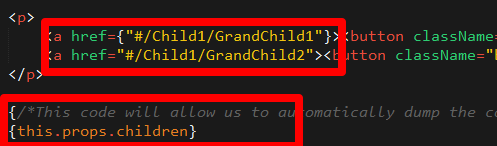

* Answer any questions that remain, before slacking out a zip of the solution.

### 10.	Partners Do: Research ES6		(0:10)

* Take a moment to transition away from React Routing and MERN for a moment -- to instead move to ES6. Let students know that ES6 is the latest standard of Javascript and that it opens up some new features. Let them know that learning ES6 is important for two reasons: 1) It's a frequent desirable skill on job openings and 2) It's very common on React Native tutorials. 

* Slack out the following instructions:

	* With your partners: Find at least three new ES6 features and explain them to one another. Be prepared to share with the group. 

* Once time is up, go over these features with students. 

### 11.	Instructor Do: ES6 Demos (0:10)

* Then proceed to open up the file `comparison.js` inside of `05-ES6Demos`. Walk students through the various new changes to ES6. The most useful ones to point out are likely "Template Literals", "Fat Arrow", and "Classes". Don't spend too much time here. It's sufficient to just vaguely explain and slack out the code -- letting students know that this is all extra information for them.  

-------

### 12.	End		

-------

### 13.	Bonus: Students Do: ES6 Address	(0:40)

* If any time remains. Task students with converting the previous React Address application to ES6 standard. This primarily means changing the components to use classes. They can reference this guide to better understand the changes. [https://facebook.github.io/react/docs/reusable-components.html#es6-classes](https://facebook.github.io/react/docs/reusable-components.html#es6-classes)

* 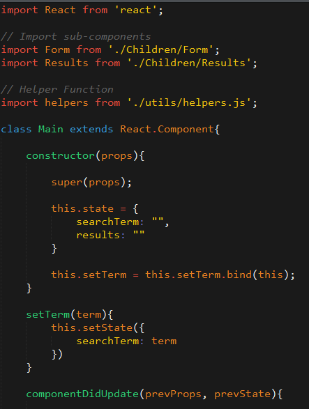

-------

### Copyright 
Coding Boot Camp (C) 2016. All Rights Reserved.
